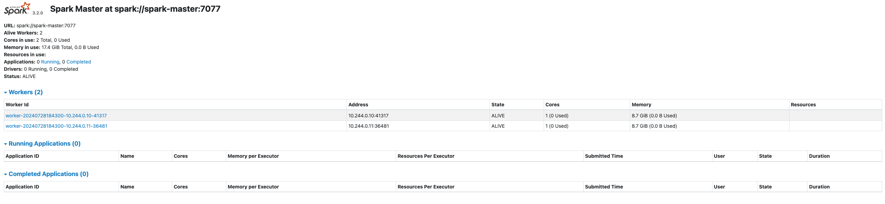

# spark-k8s-minio
A simple POC for configuring PySpark and Minio on a local Kubernetes cluster (minikube). A basic spark job creates a csv file and uploads it to Minio within the cluster.

Start the cluster:
```
minikube start --memory 8192 --cpus 4
minikube dashboard
```

Build Docker image:
```
eval $(minikube docker-env)
docker build -t spark-hadoop:3.2.0 .
```

Create the deployments and services:
```
kubectl create -f ./kubernetes/spark-master-deployment.yaml
kubectl create -f ./kubernetes/spark-master-service.yaml
kubectl create -f ./kubernetes/spark-worker-deployment.yaml
```

In order to access the Spark web UI (port 8080) outside the cluster, configure an Ingress object
```
minikube addons enable ingress
kubectl apply -f ./kubernetes/minikube-ingress.yaml
```
On Linux:
```echo "$(minikube ip) spark-kubernetes" | sudo tee -a /etc/hosts```

On MacOs: 
Dont use minikube ip! You need to update /etc/hosts with a different ip address.

```echo "127.0.0.1 spark-kubernetes" | sudo tee -a /etc/hosts```

You can also do it manually in the terminal on either Linux or MacOs:
```
sudo vi /etc/hosts
127.0.0.1 spark-kubernetes
```

Then run `minikube tunnel`

Now test it out in the browser: [http://spark-kubernetes/](http://spark-kubernetes/)



Try running the Spark shell:
```
kubectl exec spark-master-56465454b7-wrcb4 -it -- \
    pyspark --conf spark.driver.bindAddress=10.244.0.9 \
    --conf spark.driver.host=10.244.0.9 \
    --conf spark.driver.bindAddress=127.0.0.1
```

Or submit the spark job to the master node directly:
```
kubectl exec spark-master-56465454b7-wrcb4  -it -- \
    spark-submit spark_jobs/main.py \
    --conf spark.executor.instances=1 \
    --conf spark.kubernetes.container.image=spark-hadoop:3.2.0 \
    --deploy-mode cluster
```

## Minio

`kubectl get svc -A`

`kubectl get pods -n minio-dev`

Run `minikube tunnel`

In the browser navigate to either: http://localhost:9090/ or http://127.0.0.1:9001

## Running end-to-end process

To simplify the execution of cluster creation, running the Spark job, and
uploading a csv to Minio - run the following command:

`make start`

To view other commands, refer to the Makefile in the root level of the repo.

## References
- https://wganesh.medium.com/spark-on-minikube-d577e92539be
- https://testdriven.io/blog/deploying-spark-on-kubernetes/
- https://github.com/wganesh/sparkonminikube/tree/main
- https://github.com/stijndehaes/pyspark-k8s-example
- https://github.com/CoorpAcademy/docker-pyspark/blob/master/Dockerfile
- https://github.com/rodalbuyeh/pyspark-k8s-boilerplate/tree/master
- https://medium.com/israeli-tech-radar/developing-a-pyspark-application-on-a-local-kubernetes-cluster-using-macos-b73d5c0f26ee
- https://www.youtube.com/watch?v=6BlY8Zr8-Cc
- https://github.com/adityajoshi12/kubernetes-development/tree/main/minio
